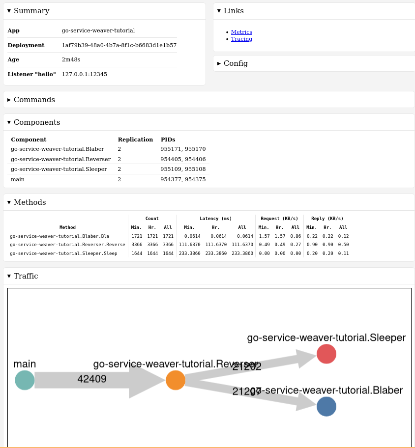

# Google's Service Weaver tutorial

I just went through Google's Service Weaver tutorial and added a few things to see for myself how this works, what
it does etc.

# Quick run

> _NOTE_: You need:
> 
> - Go 1.19+ ([this might help](https://github.com/brunodrugowick/pop-os-setup/blob/96ec471f563fa90641a99571a494b675b8d8f194/src/setup_programming.sh#L27-L37));
> - Apache Benchmark (`sudo apt install apache2-utils`).

## Multi mode

```shell
./run.sh multi
```

Clicking through you gonna get to a page like this:



`CTRL+C` to stop everything. Or wait the 5M `ab` requests to end.

## Single mode

```shell
./run.sh
```

`CTRL+C` to stop everything. Or wait the 5M `ab` requests to end.
